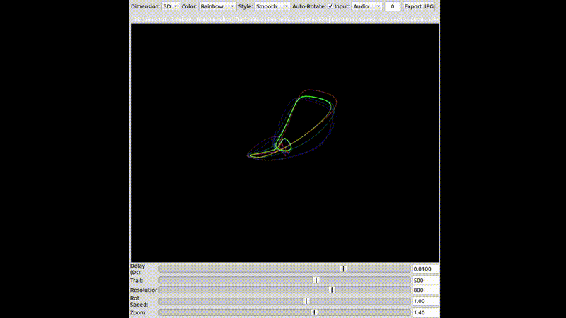

```markdown
# AttractorScope

A real-time audio visualization tool for **SuperCollider** that generates attractor-based visualizations from audio or control bus signals in 2D through 6D space.



---

## Overview

**AttractorScope** is a visualization class for SuperCollider that transforms audio or control-rate signals into dynamic, multi-dimensional **phase-space embeddings**.
By constructing delayed coordinate representations of input signals in 2D–6D space, it provides an intuitive way to observe the underlying structure, periodicity, and complexity of sound signals — concepts rooted in nonlinear dynamics and chaos theory.

This approach is based on **delay coordinate embedding**, a method introduced by **Packard et al. (1980)** and formalized by **Takens (1981)**.
In this technique, a single time series is reconstructed in an N-dimensional phase space using time-delayed versions of the signal:

\[
\mathbf{x}(t) = [s(t), s(t - \tau), s(t - 2\tau), \dots, s(t - (N-1)\tau)]
\]

where \( s(t) \) is the signal, \( \tau \) is the delay time, and \( N \) is the embedding dimension.
This process reveals the attractor geometry of the underlying dynamical system, allowing visual analysis of periodic, quasi-periodic, and chaotic behaviors.

**References:**
- Packard, N. H., Crutchfield, J. P., Farmer, J. D., & Shaw, R. S. (1980). *Geometry from a time series.* Physical Review Letters, 45(9), 712–716.
- Takens, F. (1981). *Detecting strange attractors in turbulence.* Lecture Notes in Mathematics, 898, 366–381.
- Kantz, H., & Schreiber, T. (2004). *Nonlinear Time Series Analysis* (2nd ed.). Cambridge University Press.

---

## Features

### Multi-Dimensional Visualization
- **2D–6D Support**: Visualize signals in up to six reconstructed dimensions
- **Dynamic Projection**: Higher dimensions projected into 2D screen space
- **Real-time Rotation**: Continuous rotation through any dimensional plane

### Rendering Styles
- **Lines** – Classic attractor trail visualization
- **Points** – Discrete point-based rendering
- **Glow** – Points with a soft glow effect
- **Ribbon** – 3D-style ribbon with depth shading
- **HeatMap** – Density-based trajectory visualization
- **Smooth** – Anti-aliased smooth lines

### Color Schemes
- **Static Colors**: Nine presets (Yellow, White, Cyan, Magenta, Green, Red, Blue, Orange, Purple)
- **Rainbow**: Animated color cycling
- **Velocity**: Color based on motion speed
- **Distance**: Color based on distance from origin
- **Curvature**: Color based on trajectory curvature

### Interactive Controls
- Full GUI with sliders and menus
- Keyboard shortcuts and mouse interaction
- Resizable window (toggle between small/large)
- Auto-rotation mode

---

## Installation

Clone this repository into your **SuperCollider Extensions** directory, depending on your operating system.

### **macOS**
```bash
cd ~/Library/Application\ Support/SuperCollider/Extensions/
git clone https://github.com/Kosmas-Giannoutakis/SurrealGenerativeMusic.git
```

### **Linux**
```bash
cd ~/.local/share/SuperCollider/Extensions/
git clone https://github.com/Kosmas-Giannoutakis/SurrealGenerativeMusic.git
```

### **Windows**
```bash
cd "%AppData%\SuperCollider\Extensions"
git clone https://github.com/Kosmas-Giannoutakis/SurrealGenerativeMusic.git
```

Then recompile the SuperCollider class library:
**SuperCollider → Language → Recompile Class Library**
or press `Ctrl` + `Shift` + `L` (`Cmd` + `Shift` + `L` on macOS).

---

## Quick Start

### Basic Usage
```supercollider
// Boot the server
s.boot;

// Simple test signal
{ SinOsc.ar(440) * 0.5 }.play;

// Create an AttractorScope on audio bus 0
a = AttractorScope(s, 0);
```

### Noisy Phase Modulation Example
```supercollider
(
// Chaotic feedback oscillator
{
	var fb = LocalIn.ar(2);
	var freq = 120;
	var mod = SinOsc.kr(0.05).range(0, 2); // slow morph control
	var sig = SinOsc.ar(freq, fb * mod, 1, fb * 0.5);
	LocalOut.ar(sig);
	sig!2
}.play;

// Visualize it
a = AttractorScope(s, 0, dimension: 3, trailLength: 1000, resolution: 1000);
)
```

### Custom Parameters
```supercollider
a = AttractorScope(
    server: s,
    index: 0,
    bufsize: 4096,
    delayTime1: 0.01,
    trailLength: 500,
    resolution: 800,
    dimension: 3,
    rotationSpeed: 1.0,
    zoom: 1.0,
    rate: \audio
);
```

---

## Keyboard Shortcuts

| Key | Function |
| :--- | :--- |
| `2`–`6` | Set visualization dimension |
| `c` | Cycle color schemes |
| `s` | Cycle rendering styles |
| `m` | Toggle window size |
| `r` | Reset view |
| `a` | Toggle auto-rotation |
| `Space` | Clear all points |
| `+` / `=` | Increase rotation speed |
| `-` | Decrease rotation speed |
| `z` | Zoom in |
| `_` | Zoom out |
| Mouse drag | Manual rotation (disables auto-rotation) |

---

## Parameters

### Core Parameters

| Parameter | Type | Range | Default | Description |
| :--- | :--- | :--- | :--- | :--- |
| `server` | Server | - | `default` | SuperCollider server instance |
| `index` | Integer/Bus | 0–N | 0 | Audio or control bus index |
| `bufsize` | Integer | 128+ | 4096 | Internal buffer size |
| `delayTime1` | Float | 0.0001–0.05 | 0.01 | Base delay time |
| `trailLength` | Integer | 10–5000 | 500 | Number of visible trail points |
| `resolution` | Integer | 100–2000 | 800 | Points computed per second |
| `dimension` | Integer | 2–6 | 3 | Embedding dimensionality |
| `rotationSpeed` | Float | 0.1–5.0 | 1.0 | Auto-rotation speed multiplier |
| `zoom` | Float | 0.25–4.0 | 1.0 | Initial zoom level |
| `rate` | Symbol | - | `\audio` | Bus rate: `\audio` or `\control` |

### Delay Times
The scope uses multiple delayed versions of the input signal as coordinates:
- `delayTime1`: First delay (base)
- `delayTime2`: Second delay (2× base)
- `delayTime3`: Third delay (3× base)
- `delayTime4`: Fourth delay (4× base)
- `delayTime5`: Fifth delay (5× base)

Different delay values shape the attractor differently. Try values between 0.001 and 0.1 seconds.

---

## Technical Details

### Implementation Overview
- **Signal Delays** – Uses `DelayN` UGens to create delayed signal versions
- **Coordinate Mapping** – Constructs N-dimensional vectors from delayed samples
- **Rotation Matrices** – Applies multi-dimensional rotations
- **Projection** – Projects higher dimensions into 2D space for visualization
- **Rendering** – Draws the trajectory using optimized `Pen`-based rendering

### Performance
- Adaptive resolution for CPU efficiency
- Cached color palettes
- Smooth interpolation between frames
- Optimized drawing operations

---

## Credits
Developed by Kosmas Giannoutakis for experimental sound analysis and nonlinear signal visualization in SuperCollider.

## License
Licensed under the **GNU General Public License v3.0**. See `LICENSE` for details.
```
